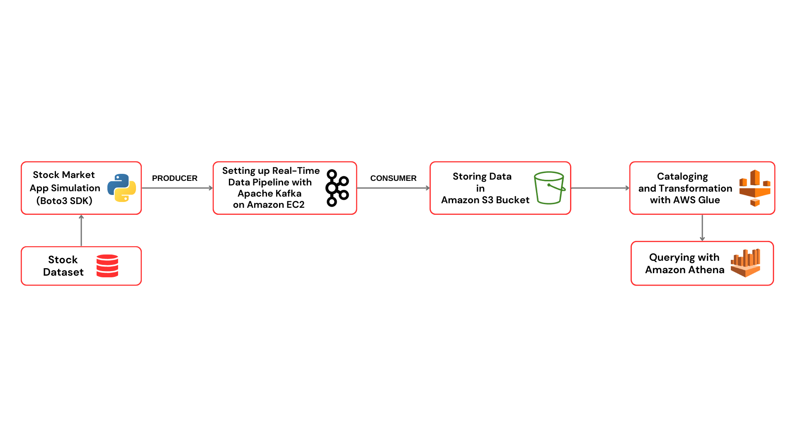

# Analyzing Stock Market in Real-Time using Apache Kafka

# Technology Used
- Python
- Amazon Web Service (AWS)
  - S3 (Simple Storage Service)
  - Athena
  - Glue Crawler
  - Glue Catalog
  - EC2
- Apache Kafka
- Jupyter Notebook - IDE
  
# Architecture Diagram

